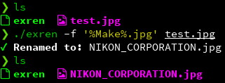

# exren

The EXif RENamer. Renames image files based on EXIF tags and a format string.

## Installation

`go get git.neveris.one/gryffyn/exren`

## Usage

```
NAME:
   exren - the exif renamer

USAGE:
   exren [global options] command [command options] [arguments...]

VERSION:
   v0.1.3

COMMANDS:
   help, h  Shows a list of commands or help for one command

GLOBAL OPTIONS:
   --format value, -f value  Output format, including extension
   --help, -h                show help (default: false)
   --version, -v             print the version (default: false)

```  

The format string takes exif tags in the format `%TagName%`.

### Valid field names
```
var ValidFields = []string{"ImageWidth", "ImageLength", "BitsPerSample", "Compression", "PhotometricInterpretation",
	"Orientation", "SamplesPerPixel", "PlanarConfiguration", "YCbCrSubSampling", "YCbCrPositioning", "XResolution",
	"YResolution", "ResolutionUnit", "DateTime", "ImageDescription", "Make", "Model", "Software", "Artist",
	"Copyright", "ExifIFDPointer", "GPSInfoIFDPointer", "InteroperabilityIFDPointer", "ExifVersion", "FlashpixVersion",
	"ColorSpace", "ComponentsConfiguration", "CompressedBitsPerPixel", "PixelXDimension", "PixelYDimension",
	"MakerNote", "UserComment", "RelatedSoundFile", "DateTimeOriginal", "DateTimeDigitized", "SubSecTime",
	"SubSecTimeOriginal", "SubSecTimeDigitized", "ImageUniqueID", "ExposureTime", "FNumber", "ExposureProgram",
	"SpectralSensitivity", "ISOSpeedRatings", "OECF", "ShutterSpeedValue", "ApertureValue", "BrightnessValue",
	"ExposureBiasValue", "MaxApertureValue", "SubjectDistance", "MeteringMode", "LightSource", "Flash", "FocalLength",
	"SubjectArea", "FlashEnergy", "SpatialFrequencyResponse", "FocalPlaneXResolution", "FocalPlaneYResolution",
	"FocalPlaneResolutionUnit", "SubjectLocation", "ExposureIndex", "SensingMethod", "FileSource", "SceneType",
	"CFAPattern", "CustomRendered", "ExposureMode", "WhiteBalance", "DigitalZoomRatio", "FocalLengthIn35mmFilm",
	"SceneCaptureType", "GainControl", "Contrast", "Saturation", "Sharpness", "DeviceSettingDescription",
	"SubjectDistanceRange"}
```

Not every file will have all of these fields. You'll probably want to check what exif fields are available with a tool like [`exiftool`](https://exiftool.org/) or [`exif-read-tool`](https://github.com/dsoprea/go-exif#reader-tool).

## Screenshot



Copyright 2021 gryffyn, see LICENSE for details.  
EXIF parsing library copyright [rwcarlsen](https://github.com/rwcarlsen).
